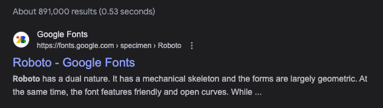
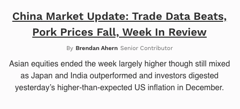

## The Internet is Hard

Yes, The Internet is Hard. The Internet is the only place we can create something once, and have it distributed the entire world in perpetuity. That means that The Internet is also where the most inspired works from both the living and deceased can easily be accessed by everyone. That means, To engage on The Internet is to compete with them directly for attention. It is easy to appreciate this and then resolve to the notion of incompetence. The Internet is hard. 

 

Tim Ferriss approach: "A category of one" 

Niche down => niche down => niche down => become the "only" 

## Choices = Placement

Every choice places the brand into a kind of category. Each category has associative baggage. This is neither good or bad. It just is we can use to either associate with or go against as a function of niching down. These choices also compound in one way or the other. Clarity is king!

:::info Case Study - Serif 

Name: Merriweather
 
Associates: 
Weight, Seriousness, Conservatism, Prosperity
 

Example: 

  ABCDEFGHIJKLMNOPQRSTUVWXYZ
   

  abcdefghijklmnopqrstuvwxyz
  
  
    Example of Serif/Merriweather on Forbes.com:

  

  Result: User understands that a serious topic is being communicated in a serious way. 
:::
:::info Case Study - Sans Serif

Name: Roboto
 
Associates: 
Modernity, Simplicity, Informality, Utility
 
Example: 

  ABCDEFGHIJKLMNOPQRSTUVWXYZ
   

  abcdefghijklmnopqrstuvwxyz
  
  

   Sans Serif/Roboto on Google.com:

  

  Result: User understands that a educational topic is being communicated in a casual way. 
:::

## Associative Baggage X Niching Down to Only 

Let's stay on the topic of fonts. We can leverage the font choice in two ways. We can align our brand with the associative baggage of a Sans Serif, or we can negate the associative baggage of a Sans Serif.  

What if a Forbes.com competitor started using Sans Serif to negate the framing of the Serif's associate baggage (Weight, Seriousness, Conservatism, Prosperity)? What might that communicate? 

  

Result: Less Formality, unbaised and neutral, Modern, Readable

If the brand's strategic offering is to deliver financial news w in an unbaised, modern, casual way, this might be a winning strategy. 

What if instead of a Sans Serif, a comically font was use. Niche of one might be achieved but the friction might be too high. Image a comic sans on Forbes.com... it breaks. 

## Next Steps 

What is our brand's strategic offering?   
In what ways are we hoping to differentiate ourselves from others?  
In what ways are we hoping to align with others?  
 
How do these brand desicions corelate to our design decisions? 

The internet is hard. 