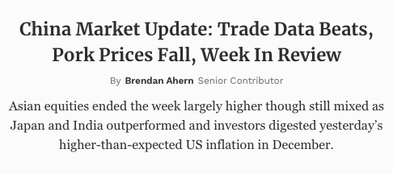

## The Internet is Hard

Let's back up! 

Navigating the digital world is tough. The internet offers endless opportunities, but also demands constant attention and recognition. It's easy to feel lost in the sea of voices out there.  

Tim Ferriss' approach of "A category of one." Basically, it's about finding your unique identity by placing yourself in catagories that otherwise don't usually crossover. 

Niche down => niche down => niche down = become the "only" and win

## Choice = Placement

Every choice places the brand into a kind of category. Each category has associative baggage. This is neither good or bad. It just is we can use to either associate with or go against as a function of niching down. These design choices compound in one way or the other. It is easy to have conflicting choices if the brand's identity and placement is not sufficiently articulated beforehand. Clarity is king!

:::info Case Study - Serif 

Name: Merriweather
 
Associates: 
Weight, Seriousness, Conservatism, Prosperity
 

Example: 

  ABCDEFGHIJKLMNOPQRSTUVWXYZ
   

  abcdefghijklmnopqrstuvwxyz
  
  
    Example of Serif/Merriweather on Forbes.com:

  

  Result: User understands that a serious topic is being communicated in a serious way. 
:::
:::info Case Study - Sans Serif

Name: Roboto
 
Associates: 
Modernity, Simplicity, Informality, Utility
 
Example: 

  ABCDEFGHIJKLMNOPQRSTUVWXYZ
   

  abcdefghijklmnopqrstuvwxyz
  
  

   Sans Serif/Roboto on Google.com:

  

  Result: User understands that a educational topic is being communicated in a casual way. 
:::

## Associative Baggage X Niching Down to Only 

Sticking with the topic of fonts, we can leverage the font choice in one of two ways. We can align our brand with the associative baggage of a Serif, or we can negate the associative baggage of a Serif.  

What if a Forbes.com competitor started using Sans Serif to negate the framing of the Serif's associate baggage (Weight, Seriousness, Conservatism, Prosperity)? What might that communicate? 

  

Result: Less Formality, Unbaised, Neutral, Modern, Readable

If the brand's strategic offering is to deliver financial news w in an unbaised, modern, casual way, this might be a winning strategy. 

What if instead of a Sans Serif, a comically font was use. Niche of one might be achieved but the friction might be too high. Image a comic sans on Forbes.com... it breaks. 

## Next Steps 

What is our brand's strategic offering?   
Who are others in the space offering? 
In what ways are we hoping to differentiate ourselves from others?  
In what ways are we hoping to align with others?  
What design choices have are competitors made?  
What are all of the design choices at play? 
How do these brand desicions corelate to our design decisions? 

The internet is hard. 